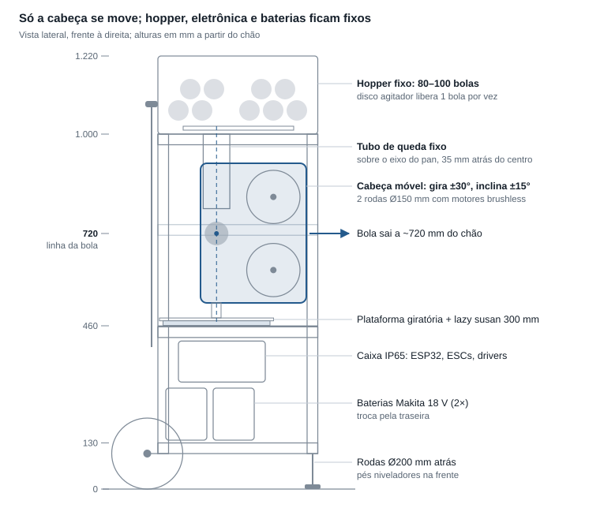
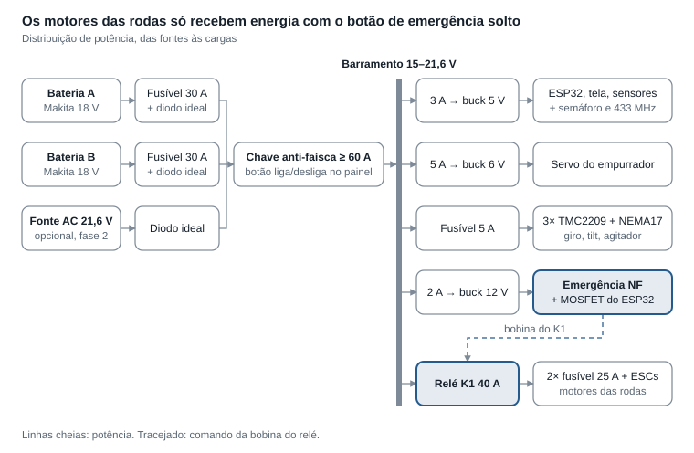

# Lançador de Bolas de Tênis — Projeto Detalhado

Revisão de 6 de outubro de 2026 · [apresentação com o modelo 3D](https://brodwolf.github.io/lancador-tenis/) · [repositório](https://github.com/brodwolf/lancador-tenis). Esta versão traz o memorial técnico completo; preços, custos e próximos passos ficam de fora.

## 1. Visão geral e decisões de projeto

O conceito foi mantido — duas rodas com velocidades independentes, ESP32 por Wi‑Fi, pan/tilt com NEMA17, baterias Makita e estrutura de alumínio — com dez ajustes que o tornam construível, mais leve e mais seguro.

A ideia central: **só a "cabeça" se move** (rodas + motores + inclinação). Todo o resto (hopper, eletrônica, baterias) fica preso à estrutura externa, e a bola desce por um tubo fixo exatamente sobre o eixo de giro.

| # | No conceito | No projeto | Por quê |
| --- | --- | --- | --- |
| 1 | Hopper no topo da pilha que gira/inclina | Hopper fixo no anel superior; tubo de queda fixo no eixo do pan | 80 bolas pesam ~4,6 kg; não faz sentido girá-las. Cabeça fica leve e rápida |
| 2 | Colunas internas + estrutura externa | Só a estrutura externa (perfil 30×30); níveis são placas presas nela | Metade do material, mais rígido, menos ajustes |
| 3 | Pan ±45° | Pan ±30° (±35° mecânico) | Na quadra o ângulo máximo útil é ~13–25°. Com ±45° num chassi de 55 cm a bola bate nas colunas dianteiras |
| 4 | Eixos independentes | Eixo do pan passa pelo berço da bola; pivô do tilt fica na linha de saída da bola | O recuo do disparo passa pelos eixos e não desvia a mira |
| 5 | Motores "DC" | Brushless outrunner + ESC + sensor Hall de RPM, malha fechada | Sem escovas para gastar; RPM constante = spin repetível |
| 6 | Roda direto no eixo do motor | Roda em eixo próprio (Ø12) com 2 mancais + acoplamento elástico | O impacto da bola não vai para os rolamentos do motor |
| 7 | "Alimentador servo/motor" | Disco agitador com 4 bolsões (NEMA17) + empurrador com servo | Libera exatamente 1 bola por comando e empurra sempre com a mesma velocidade |
| 8 | 2 baterias em paralelo | Cada bateria passa por um diodo ideal; chave geral, relé de potência e botão de emergência | Baterias com cargas diferentes em paralelo direto trocam corrente entre si. Diodo ideal permite hot swap seguro |
| 9 | Entrada AC + porta de carga DC | AC opcional (fase 2) com fonte fechada Mean Well; porta de carga removida | Carregar Li‑ion exige carregador próprio: use o carregador Makita |
| 10 | Tilt ±15° | Mantido ±15° | Lob precisa de +30°; fica como evolução (exige subir o tubo de queda ~10 cm) |

Este memorial define dimensões, componentes, ligações e firmware. Os arquivos de CAD (STEP, STL e DXF) seguem estas cotas e estão na pasta `cad/` do repositório.

## 2. Especificações-alvo

A máquina lança de 30 a 120 km/h com até 3.000 rpm de spin, cobrindo aquecimento, drives, topspin, slice e bolas rápidas.

| Parâmetro | Alvo | Observação |
| --- | --- | --- |
| Velocidade da bola | 30–120 km/h | Calibrada por fator de eficiência no firmware |
| Spin | −2.500 rpm (slice) a +3.000 rpm (topspin) | Diferença de velocidade entre as rodas |
| RPM máxima da roda | 5.500 rpm | Limite de projeto (roda Ø150 mm) |
| Cadência | 1 bola a cada 1,5–10 s | Só dispara quando as duas rodas estão na RPM alvo |
| Giro horizontal (pan) | ±30° | Resolução melhor que 0,02° |
| Inclinação (tilt) | −15° a +15° | +30° como evolução para lobs |
| Altura de lançamento | ~0,72 m | Com tilt em 0° |
| Capacidade do hopper | 80–100 bolas | Hopper fixo, removível para transporte |
| Alimentação | 2× Makita 18 V LXT, hot swap | Entrada AC opcional (fase 2) |
| Autonomia | 2,3–4,5 h com 2× 5,0 Ah | Ver cálculo na seção 3 |
| Dimensões em uso | 55 × 45 × ~120 cm | Estrutura de 100 cm + hopper |
| Peso | ~20–24 kg sem bolas | 80 bolas somam ~4,6 kg |
| Controle | Celular via Wi‑Fi (navegador) | Sem app para instalar; botão de emergência físico |

## 3. Física e dimensionamento

Com rodas de Ø150 mm, a bola mais exigente (110 km/h com 3.000 rpm de topspin) pede 5.443 rpm na roda de cima, por isso o limite de projeto é 5.500 rpm.

### 3.1 Velocidade e spin

A bola sai com a média das velocidades periféricas das rodas, menos as perdas por compressão e escorregamento. O spin vem da diferença entre as rodas.

```math
v_{bola} \approx \eta \cdot \frac{v_{sup} + v_{inf}}{2} \qquad \omega_{bola} \approx k \cdot \frac{v_{sup} - v_{inf}}{g}
```

Para o firmware, a conta é invertida (o usuário escolhe velocidade e spin, a máquina calcula as RPMs):

```math
v_{sup,inf} = \frac{v_{bola}}{\eta} \pm \frac{\omega_{bola} \cdot g}{2k} \qquad RPM = \frac{60 \cdot v_{roda}}{\pi \cdot D_{roda}}
```

Onde g = vão entre as rodas (56 mm), D = diâmetro da roda (150 mm), η ≈ 0,90 e k ≈ 1,0 são fatores de calibração ajustados na prática. Spin positivo = topspin (roda de cima mais rápida).

| Tipo de bola | Velocidade (km/h) | Spin (rpm) | Roda superior (rpm) | Roda inferior (rpm) |
| --- | --- | --- | --- | --- |
| Aquecimento | 40 | 0 | 1.572 | 1.572 |
| Voleio | 60 | 0 | 2.358 | 2.358 |
| Slice | 70 | −1.500 | 2.191 | 3.310 |
| Drive plano | 80 | 0 | 3.143 | 3.143 |
| Topspin médio | 80 | +1.500 | 3.704 | 2.583 |
| Topspin pesado | 90 | +2.500 | 4.470 | 2.604 |
| Bola rápida plana | 120 | 0 | 4.716 | 4.716 |
| Limite de projeto | 110 | +3.000 | 5.443 | 3.203 |

### 3.2 Inércia da roda e consistência

A bola a 120 km/h leva ~32 J de energia cinética (m = 57,5 g). Cada roda cede ~15–25 J por disparo, contando as perdas.

Cada roda tem I ≈ 2,6 × 10⁻³ kg·m² (núcleo impresso + 2 discos de aço + banda de TPU, ~1 kg). A 3.500 rpm ela guarda ~175 J, então cai só 5–7% de RPM por disparo. O firmware espera a RPM voltar (< 0,5 s) antes do próximo disparo.

### 3.3 Motores

- **KV:** para chegar a 5.500 rpm com carga e bateria no fim (16 V), KV ≥ 5.500 / (0,85 × 16) ≈ 400. Faixa recomendada: **400–500 KV**.
- **Torque de partida:** acelerar de 0 a 3.500 rpm em 5 s exige ~0,19 N·m (~9 A por motor). Rampas mais rápidas somam corrente; o firmware limita a rampa para manter o total abaixo de 25 A.
- **Recuperação:** repor 20 J em 0,5 s = ~40 W por motor, uma fração da capacidade.
- **Classe:** outrunner 42xx–50xx, ≥ 500 W. A potência média é baixa; a folga é térmica e de durabilidade.

### 3.4 Autonomia

Uma Makita 18 V 5,0 Ah tem 90 Wh, dos quais ~80 Wh são úteis até 15 V. Duas baterias dão ~160 Wh.

| Situação | Consumo médio | Autonomia (2× 5,0 Ah) |
| --- | --- | --- |
| Rodas girando, sem disparar | ~25 W | ~6 h |
| Treino típico (80 km/h, 1 bola a cada 4 s) | ~35–45 W | ~3,5–4,5 h |
| Treino pesado (120 km/h, 1 bola a cada 2 s) | ~60–70 W | ~2,3–2,7 h |

São estimativas. O firmware mede a tensão de cada bateria; com um sensor de corrente opcional (INA226) você mede o consumo real.

### 3.5 Trajetória e simulação na quadra

A aba **Quadra**, ao lado do modelo 3D, mostra onde a bola quica. A máquina fica com a frente encostada na linha de saque (ou na linha de fundo) e a bola sai do ponto de contato das rodas, a ~0,72 m do chão, na direção dada pelo giro e pela inclinação. Também dá para tocar num ponto da quadra adversária: a página calcula o giro e a inclinação para a bola quicar ali.

[Abrir a simulação na quadra](https://brodwolf.github.io/lancador-tenis/#quadra)

Em voo, a bola sofre o peso, o arrasto do ar e a força de Magnus causada pelo spin:

```math
m\,\frac{d\vec v}{dt} = m\,\vec g \;-\; \tfrac{1}{2}\,\rho A\,C_D\,|\vec v|\,\vec v \;+\; \tfrac{1}{2}\,\rho A\,C_L\,|\vec v|^2\,(\hat\omega \times \hat v)
```

Os coeficientes vêm do ajuste empírico de Goodwill, Chin e Haake (2004), medido em túnel de vento com bolas girando, em função da razão entre a velocidade da bola, v, e a velocidade periférica do spin, v_s = r·ω:

```math
C_D = 0{,}55 + \frac{1}{\left[\,22{,}5 + 4{,}2\,(v/v_s)^{2{,}5}\right]^{0{,}4}} \qquad C_L = \frac{1}{2 + v/v_s}
```

No quique, a velocidade vertical volta multiplicada pelo coeficiente de restituição e, e o atrito freia o ponto de contato até a bola parar de escorregar e começar a rolar (modelo de R. Cross). O mesmo atrito muda o spin: o topspin sai do quique mais rápido para a frente, e o slice freia e fica baixo.

```math
v_y' = -e\,v_y \qquad J_t = \min\!\left(\mu\,(1+e)\,|v_y|,\; \frac{\alpha}{1+\alpha}\,|u_c|\right) \qquad I = \alpha\, m\, r^2
```

Onde u_c é a velocidade do ponto de contato com o chão e J_t é o impulso de atrito por unidade de massa. A trajetória é integrada por Runge‑Kutta de 4ª ordem com passo de 2 ms.

| Parâmetro | Valor usado |
| --- | --- |
| Bola | 57 g, Ø67 mm, α = 0,55 |
| Ar | ρ = 1,21 kg/m³ (nível do mar, 20 °C), sem vento |
| Quadra rápida | e = 0,78, μ = 0,65 |
| Saibro | e = 0,80, μ = 0,80 |
| Rede | 0,914 m no centro, 1,07 m nos postes |
| Bola dentro | 1º quique na quadra de simples do adversário; a linha conta como dentro |

Inclinação que põe o 1º quique dentro e onde ele cai (distância depois da rede), em quadra rápida, com a máquina no centro:

| Bola | Velocidade e spin | Da linha de saque | Da linha de fundo |
| --- | --- | --- | --- |
| Aquecimento | 40 km/h, sem spin | não alcança (pede +18,8°) | não passa a rede |
| Voleio | 60 km/h, sem spin | +9,1° a +15° → 4,3–7,4 m | não alcança (pede +16°) |
| Drive plano | 80 km/h, sem spin | +5,9° a +11,8° → 6,6–11,8 m | +9,2° a +15° → 4,1–8,9 m |
| Topspin médio | 80 km/h, +1.500 rpm | +7,2° a +15° → 5,4–10,7 m | +11,8° a +15° → 3,1–5,2 m |
| Slice | 70 km/h, −1.500 rpm | +6,1° a +14,3° → 6,1–11,8 m | +9,9° a +15° → 3,5–6,8 m |
| Topspin pesado | 90 km/h, +2.500 rpm | +6,6° a +14,7° → 5,8–11,9 m | +10,7° a +15° → 3,5–6,6 m |
| Bola rápida plana | 120 km/h, sem spin | +3,7° a +3,9° → 11,5–11,9 m | +4,7° a +6,9° → 7,9–11,7 m |

**O que isso diz sobre o projeto:** da linha de saque, de 70–80 km/h para cima a máquina põe a bola em qualquer profundidade, da área de saque até perto da linha de fundo; a 60 km/h ela chega a ~7 m da rede. Da linha de fundo, com o limite de +15°, o topspin médio cai no máximo a ~5 m da rede e bolas de 60 km/h ou menos não passam. O aquecimento a 40 km/h pede ~+19° mesmo da linha de saque. Isso reforça a evolução do tilt para +30° (seção 1, item 10): ela serve para lobs, para bolas lentas e para treinar da linha de fundo.

São aproximações. Bola gasta, altitude (em São Paulo o ar é ~7% menos denso, e a bola vai um pouco mais longe), vento e os valores reais de η e k mudam o quique em alguns decímetros. A calibração do protótipo (seção 19) acerta os números.

## 4. Arquitetura e cotas

A linha da bola fica a 720 mm do chão, e por ela passam os dois eixos: o pan (vertical, pelo berço) e o tilt (horizontal, pelo mesmo ponto).



Como o recuo do disparo age ao longo da linha da bola, e essa linha cruza os dois eixos, o tiro não gera torque que desvie a mira. O tubo de queda fica parado enquanto a cabeça gira em volta dele.

## 5. Estrutura externa

A estrutura é uma caixa de perfil de alumínio 30×30 canal 8, com 550 × 450 mm de base e colunas de 900 mm, somando ~11 m de perfil (~6–9 kg conforme a série do perfil).

**Referência de cotas:** z = altura a partir do chão; x = largura (0 no centro); y = profundidade (positivo para a frente, 0 no centro). A base da estrutura fica a z = 100 mm (altura do eixo das rodas).

### 5.1 Anéis horizontais

| Anel | Altura (topo do perfil) | Lados | Função |
| --- | --- | --- | --- |
| A — base | z = 130 mm | 4 | Piso das baterias, suporte do eixo das rodas e dos pés |
| C — pan | z = 460 mm | 4 + 2 travessas internas | Placa base do pan em cima; caixa elétrica pendurada embaixo |
| E — reforço | z = 730 mm | 3 (laterais e trás) | Rigidez; a frente fica livre para a janela de lançamento |
| D — topo | z = 1.000 mm | 4 | Apoio do hopper e da alça |

### 5.2 Lista de corte (perfil 30×30 canal 8)

| Peça | Qtd | Comprimento (mm) |
| --- | --- | --- |
| Coluna | 4 | 900 |
| Travessa frontal/traseira (anéis A, C, D) + traseira do anel E | 7 | 490 |
| Travessa lateral (anéis A, C, D, E) | 8 | 390 |
| Travessa interna do anel C (sentido da profundidade) | 2 | 390 |
| **Total** | **21** | **~10,9 m** |

Peça os cortes no esquadro com tolerância de ±0,3 mm. Muitas lojas de perfil vendem cortado sob medida; vale pedir também as cantoneiras e porcas martelo do mesmo fornecedor.

### 5.3 Uniões

- Travessas encostam entre as colunas e são presas com **cantoneiras 30×30** e **porcas martelo M6** + parafusos M6×12.
- Anéis A e D: 2 cantoneiras por extremidade (dentro e fora). Anéis C e E e travessas: 1 cantoneira por extremidade.
- Total: ~60 cantoneiras. Monte com as colunas sobre uma mesa plana e confira as diagonais (diferença ≤ 1 mm).

### 5.4 Janela de lançamento e posição do eixo

- A face frontal não tem travessa entre z = 460 e z = 970 mm: é a janela de 490 × 510 mm por onde a bola sai.
- O **eixo do pan fica 35 mm atrás do centro** (y = −35). Assim a cabeça cabe na estrutura e, a ±30°, a bola passa a ~75 mm das colunas dianteiras.
- Instale uma tela ou chapa perfurada leve nas laterais e na traseira na altura da cabeça (z 460–970) para ninguém pôr a mão nas rodas.

## 6. Módulo de lançamento

Duas rodas de Ø150 mm, uma sobre a outra com vão de 56 mm, cada uma no seu eixo de Ø12 mm com dois mancais e acionada por um motor brushless através de acoplamento elástico.

**Referência do módulo:** origem no pivô do tilt (que está sobre o eixo do pan); x para a frente, z para cima. O ponto de pinçamento da bola (nip) fica em x = 160 mm, z = 0. Os centros das rodas ficam em (160, +103) e (160, −103).

### 6.1 Geometria

| Item | Valor | Nota |
| --- | --- | --- |
| Diâmetro externo da roda | 150 mm | Com banda de rodagem |
| Largura da roda | 40 mm | Perfil côncavo, raio 50 mm, 4 mm de profundidade, centraliza a bola |
| Vão entre rodas | 56 mm (ajuste 52–60) | Comprime a bola ~11 mm no total |
| Distância entre eixos | 206 mm | 150 + 56 |
| Distância pivô → nip | 160 mm | Necessária para a roda de cima não bater no tubo de queda |
| Distância interna entre placas laterais | 90 mm | Roda, colar e mancal KFL001 de cada lado |

### 6.2 Construção da roda

1. **Núcleo** impresso em PETG (ou ASA/PA‑CF): Ø134 × 32 mm, 6 perímetros, 60% gyroid, furo central Ø12,2 mm.
2. **Dois discos de aço** 3 mm, Ø120 mm (corte a laser), um em cada face: dão inércia e uma espinha metálica à roda.
3. **Seis parafusos M4** passantes prendem discos e núcleo; os discos têm **furo em D** que encaixa no chato do eixo e transmite o torque direto, sem cubo.
4. **Banda de rodagem** em TPU 95A impressa: Ø134 → Ø150, 40 mm de largura, com chavetas internas que encaixam em ranhuras do núcleo, mais cola PU. As chavetas impedem que ela solte com a força centrífuga.
5. **Balanceamento estático:** apoie o eixo sobre duas réguas retas niveladas; a roda deve parar em posições aleatórias. Corrija com arruelas M3 coladas no lado leve.

### 6.3 Eixos, mancais e motores

- **Eixo:** aço Ø12 h6 × 128 mm, com um chato de 1 mm em todo o comprimento (discos da roda, colares e acoplamento). Pode ser barra retificada cortada ou peça usinada.
- **Mancais:** 4× KFL001 (Ø12, 2 furos M6 a 48 mm), por dentro das placas laterais. Confirme rotação limite ≥ 6.000 rpm com o vendedor. Os furos dos mancais da roda de baixo são **oblongos (±4 mm)** para ajustar o vão.
- **Colares de trava** Ø12 dos dois lados da roda, para posicionamento axial.
- **Acoplamento elástico tipo garra** 5 × 12 mm entre motor e eixo (absorve desalinhamento e choques).
- **Motores:** brushless outrunner 400–500 KV, classe 4250 (Ø42 × 50 mm, eixo 5 mm), preso por X‑mount numa placa de alumínio 76 × 76 × 5 mm sustentada por 4 espaçadores de 89 mm.
- **Lados alternados:** motor de cima à direita, motor de baixo à esquerda, para equilibrar a cabeça sobre o eixo do pan.

### 6.4 Sensor de RPM

Do lado oposto ao motor, o eixo sobra 11 mm além da placa. Ali entra um disco impresso com 2 ímãs Ø6 × 3 mm em posições opostas (2 pulsos por volta, sem desbalancear). Um sensor Hall A3144 fica a 2–4 mm, num suporte impresso preso na placa.

### 6.5 Guia da bola e proteção

- **Guia:** dois trilhos (varetas de alumínio Ø8 ou peça impressa) do berço até 34 mm antes do nip, terminando na horizontal. A bola chega centrada e com velocidade repetível.
- **Bocal de saída:** peça impressa na frente das rodas, mantém a bola na linha e protege as mãos.
- **Carenagem:** cobre as rodas por cima, por trás e pelos lados (policarbonato 2 mm ou PETG impresso). Também cobre o sino girante de cada outrunner.
- **Placas laterais:** alumínio 6 mm (corte a laser), unidas por 4 espaçadores de 90 mm com M6.

## 7. Módulo de inclinação (tilt)

O módulo de lançamento pivota sobre dois semi-eixos de Ø8 mm, e um NEMA17 com fuso Tr8×8 integrado o inclina entre −15° e +15° em ~1,2 s.

### 7.1 Pivô

- **Garfo:** duas placas verticais de alumínio 6 mm (corte a laser), aparafusadas na plataforma giratória, com ~235 mm do topo da plataforma até o pivô.
- **Semi-eixos, não eixo passante:** o eixo do pivô passa pelo berço da bola, então um eixo inteiro bloquearia a bola. Cada placa lateral recebe um semi-eixo Ø8 × 45 mm travado por 2 colares, um de cada lado da placa.
- **Mancais:** 2× KFL08 (flange, Ø8) nas placas do garfo.
- **Altura resultante:** pivô (= linha da bola) a ~720 mm do chão.

### 7.2 Atuador

| Item | Valor |
| --- | --- |
| Motor | NEMA17 com fuso trapezoidal Tr8×8 integrado, 150 mm |
| Montagem | Motor articulado na traseira da plataforma; porca de latão num bloco articulado preso ao módulo |
| Braço de alavanca | Porca em (x = −90, z = −40) mm no referencial do módulo |
| Curso da porca | ~47 mm para ±15° (~6 voltas) |
| Resolução | 0,0025 mm por micropasso (1/16) = ~0,002° |
| Tempo de −15° a +15° | ~1,2 s a 300 rpm |

A cabeça é pesada na frente (~3 N·m em torno do pivô), o que dá ~35 N na porca. O motor segura isso com folga, mas fica sempre energizado (corrente de retenção no TMC2209).

Uma **mola de tração** entre a traseira do módulo e a plataforma compensa o peso e mantém a porca sempre carregada para o mesmo lado, eliminando a folga.

### 7.3 Referência e limites

- **Fim de curso:** microchave acionada em −15°. Na partida, o tilt desce até ela e depois vai para 0°.
- **Limites:** ±15° no firmware e batentes de borracha em ±17°.
- **Calibração do zero:** use o inclinômetro do celular sobre a placa lateral e grave o desvio no firmware.

## 8. Módulo de giro (pan)

A plataforma giratória roda sobre um rolamento tipo lazy susan de 300 mm e é acionada por correia GT2 aberta enrolada no seu aro, com redução de ~23:1 e resolução de ~0,005°.

### 8.1 Rolamento e placas

- **Placa base do pan:** alumínio 4 mm, 550 × 450 mm com os cantos recortados (30 × 30), apoiada no anel C e nas 2 travessas internas. Furos de alívio para reduzir peso.
- **Rolamento:** lazy susan de esferas 300 mm (12"), capacidade ≥ 150 kg, centrado no eixo do pan (x = 0, y = −35 mm).
- **Plataforma giratória:** disco de alumínio 4 mm, Ø300 mm, com furo central de Ø80 mm para os cabos e furação para o garfo do tilt e o atuador.
- **Se houver folga** no lazy susan: 3 roletes de apoio (rolamentos 608 em suportes impressos) a 120°, por baixo da borda da plataforma.

### 8.2 Transmissão

| Item | Valor |
| --- | --- |
| Tipo | Correia GT2 6 mm aberta ("ômega"), pontas presas no aro da plataforma |
| Aro | Anel impresso Ø300 mm × 10 mm de altura, com 2 grampos de correia |
| Motor | NEMA17 com polia GT2 20 dentes, entre 2 polias lisas (idlers) |
| Redução | Raio do aro / raio primitivo da polia = 150 / 6,37 ≈ 23,5:1 |
| Resolução | 75.000 micropassos por volta = 0,0048° |
| Velocidade | 600 rpm no motor = 153°/s na plataforma |
| Tensionamento | Furos oblongos no suporte do motor |

A correia aberta funciona porque o giro é limitado: ela não precisa dar volta inteira. Não há folga de engrenagem, e a precisão fica muito melhor que a de uma coroa impressa.

### 8.3 Cabos, referência e limites

- **Cabos:** passam pelo furo central com uma sobra (laço) de ~20 cm, presa com abraçadeiras. Com giro de ±35°, não precisa de anel coletor (slip ring).
- **Fim de curso:** microchave acionada por um came impresso em −32°. Na partida, o pan vai até ela e depois volta ao centro.
- **Limites:** ±30° no firmware e batentes de borracha em ±35°.

## 9. Hopper e alimentador

Um disco com 4 bolsões, girado por um NEMA17, solta exatamente uma bola por comando num tubo fixo; a bola cai no berço da cabeça e um servo a empurra para as rodas.

### 9.1 Reservatório

- **Placa base:** alumínio 3 mm, 550 × 450 mm com cantos recortados, sobre o anel D, presa por 4 manípulos M8 rosqueados no topo das colunas (sai sem ferramenta para o transporte).
- **Furo de saída:** Ø76 mm exatamente sobre o eixo do pan (x = 0, y = −35).
- **Paredes:** 4 painéis de 220 mm de altura em acrílico 3 mm (corte a laser) ou policarbonato 2 mm (mais resistente a impacto, cortado em CNC), unidos por cantoneiras impressas. Tampa opcional.
- **Fundo inclinado:** 4 rampas impressas com ~15° de queda levando as bolas até o disco.
- **Capacidade:** ~30 L úteis = 80–100 bolas.

### 9.2 Disco agitador

| Item | Valor |
| --- | --- |
| Disco | PETG, Ø280 × 6 mm com cúpula cônica, 4 bolsões Ø74 mm a 95 mm do centro |
| Posição | Centro do disco em (x = −76, y = +22): um bolsão por vez fica sobre o furo de saída |
| Motor | NEMA17 curto (~34 mm) por baixo da placa base; o eixo atravessa a placa e entra no rotor, cuja cúpula faz as bolas escorregarem para os bolsões |
| Passo | 90° por bola = 800 micropassos (1/16) |
| Capuz | Peça impressa sobre o furo de saída: só a bola que está no bolsão passa por baixo; as outras ficam retidas |
| Antitravamento | Sem bola detectada no tubo → recua 30° e tenta de novo; 4 bolsões vazios seguidos → aviso "hopper vazio" |

O disco desliza sobre 3 nervuras impressas ou uma folha de PTFE/UHMW, para não arrastar na placa.

### 9.3 Tubo de queda

- Tubo de PVC esgoto DN75 (diâmetro interno ~72 mm), ~210 mm, preso na placa base por um flange impresso.
- Termina 75 mm acima da linha da bola, 25 mm acima do funil da cabeça. O funil tem boca de 84 × 130 mm (cabe entre as placas laterais) e afunila até Ø78 mm; o tubo fica dentro da boca em qualquer posição de pan e tilt.
- Sensor infravermelho E18‑D80NK atravessando o tubo: confirma que a bola caiu.

### 9.4 Berço e empurrador

- **Berço:** peça impressa no módulo de lançamento, centrada no pivô. A bola assenta numa canaleta em V com bordas que a seguram em qualquer inclinação.
- **Sensor do berço:** segundo E18‑D80NK, olhando por uma fenda lateral.
- **Empurrador:** servo de 25 kg·cm com engrenagens metálicas (ex.: DS3225), braço de 90 mm com ponta de borracha. Gira 60° e leva a bola ~90 mm pela guia até o nip, em ~0,15 s.
- **Por que empurrar e não deixar rolar:** funciona em qualquer inclinação e a bola entra sempre com a mesma velocidade, o que melhora a repetibilidade.

### 9.5 Ciclo de um disparo

1. Disco gira 90° → sensor do tubo vê a bola.
2. Sensor do berço confirma a bola.
3. Firmware espera: RPM das duas rodas dentro de ±1,5% por 300 ms, e pan/tilt parados na posição.
4. Servo empurra → bola sai → servo volta.
5. Próxima bola é liberada (o tempo mínimo do ciclo é ~1,5 s).

## 10. Base, rodas, pés e alça

A máquina se apoia em duas rodas traseiras de Ø200 mm e dois pés niveladores na frente; para transportar, inclina-se para trás e puxa-se pela alça, como um carrinho de carga.

- **Piso:** placa de alumínio 3 mm, 550 × 450 mm com cantos recortados, sobre o anel A. Recebe os dois soquetes das baterias.
- **Compartimento das baterias:** entre z = 130 e 290 mm, aberto pela traseira para trocar as baterias sem ferramenta.
- **Rodas:** 2× roda maciça (borracha ou PU) Ø200 mm, com rolamento, furo 12 mm. Ficam fora da largura da estrutura, nos cantos traseiros (largura total ~690 mm).
- **Eixo:** aço Ø12 × 700 mm, 30 mm atrás da face traseira e a z = 100 mm, preso em 2 chapas planas de aço 4 mm (corte a laser) aparafusadas nas colunas traseiras. Arruelas e anel trava ou porca autotravante nas pontas.
- **Pés dianteiros:** 2× pé nivelador articulado M8 com haste ≥ 80 mm e base de borracha Ø50–60, rosqueado no furo central das colunas dianteiras (rosca M8 feita no furo central do perfil). Ajuste até a máquina ficar nivelada.
- **Alça:** alça telescópica de mala (reposição, 2 hastes) presa por fora das colunas traseiras com abraçadeiras impressas. Recolhida fica abaixo do topo do hopper; estendida chega a ~1,3 m. Alternativa: alça fixa em tubo de alumínio Ø25.
- **Transporte em carro:** com o hopper removido (4 manípulos), a máquina fica com 1,0 m de altura.

## 11. Sistema de potência

Duas baterias Makita alimentam um barramento de 15–21 V através de diodos ideais; uma chave geral corta tudo, e um relé comandado pelo botão de emergência corta os motores das rodas.



Cada fonte entra por seu próprio diodo ideal, e só o ramo das rodas passa pelo relé comandado pelo botão de emergência.

### 11.1 Baterias e hot swap

- **Baterias:** Makita LXT 18 V, 5,0 Ah (BL1850B) ou 6,0 Ah (BL1860B).
- **Soquetes:** 2 adaptadores de bateria Makita 18 V com fios 12 AWG. Cada um passa por um **fusível de 30 A** e por um **módulo diodo ideal** (≥ 30 A) antes do barramento.
- **Por que diodo ideal:** a bateria com tensão mais alta alimenta, e não passa corrente de uma bateria para a outra. Dá para tirar uma bateria com a máquina ligada.
- **Corte por subtensão no firmware:** adaptadores simples não têm proteção contra descarga profunda; a [PartsBuilt](https://partsbuilt.com/makita-18v-battery-adapter) vende adaptadores com uma placa extra só para isso. Aqui, o ESP32 mede cada bateria e para de disparar a 15,5 V; abaixo de 15,0 V desliga as rodas.
- **Expansão para 4 baterias:** mais 2 soquetes, 2 diodos ideais e 2 fusíveis no mesmo barramento.

### 11.2 Entrada AC (opcional, fase 2)

- **Caminho:** tomada IEC C14 com fusível e chave → fonte fechada **Mean Well LRS‑350‑24** → terceiro diodo ideal → barramento.
- **Ajuste:** a saída dessa fonte vai de 21,6 a 28,8 V ([folha de dados Mean Well](https://www.meanwell.com/Upload/PDF/LRS-350/LRS-350-SPEC.PDF)). Ajuste no mínimo (21,6 V): fica acima da bateria cheia, então a fonte alimenta e as baterias descansam. Ela **não** carrega as baterias.
- **Chave de tensão de entrada:** a entrada é 90–132 ou 180–264 VAC, escolhida por chave na fonte. Em 127 V use 115; em 220 V use 230. Posição errada queima a fonte.
- **Limite de 350 W:** a fonte aguenta 150% de pico por até 1 s e depois entra em proteção. Com AC, o firmware alonga a rampa de partida das rodas.
- **Aterramento:** fio terra da tomada até a estrutura de alumínio (terminal com arruela dentada). A parte de 127/220 V fica num compartimento próprio, com os bornes cobertos. Peça a um eletricista para revisar antes de ligar.
- **Porta de carga DC:** removida. Carregue as baterias no carregador Makita.

### 11.3 Distribuição, proteção e bitolas

| Circuito | Proteção | Fio | Observação |
| --- | --- | --- | --- |
| Bateria A/B → diodo ideal | Fusível lâmina 30 A | 12 AWG (4 mm²) | Porta-fusível junto do soquete |
| Barramento → chave geral → barramento principal | Chave de bateria ≥ 100 A | 12 AWG | Conector XT90‑S antifaísca |
| Relé K1 → ESC superior | Fusível 25 A | 14 AWG (2,5 mm²) |  |
| Relé K1 → ESC inferior | Fusível 25 A | 14 AWG |  |
| ESC → motor | — | 14 AWG silicone | Conector MT60 (3 vias) para soltar a cabeça |
| Drivers TMC2209 (×3) | Fusível 5 A | 18 AWG (1 mm²) | Capacitor 1.000 µF / 35 V no barramento dos drivers |
| Buck 5 V / 3 A | Fusível 3 A | 20 AWG | ESP32 e sensores |
| Buck 6 V / 5 A (XL4015) | Fusível 5 A | 18 AWG | Servo do empurrador |
| Buck 12 V / 1 A | Fusível 2 A | 22 AWG | Bobina do relé K1 e ventoinha da caixa |
| Sinais | — | 24–26 AWG | Motores de passo: cabo 4 × 22 AWG |

### 11.4 Parada e intertravamentos

- **Chave geral** na traseira: corta toda a máquina.
- **Botão de emergência** tipo cogumelo, 1NF + 1NA, no alto da traseira. O contato NF alimenta a bobina do **relé K1 (40 A)** dos ESCs; o NA avisa o ESP32.
- **Desarme por software:** o ESP32 também abre K1 por um MOSFET (falha de sensor, perda de Wi‑Fi em modo treino, bateria baixa).
- **Inércia:** sem energia, as rodas ainda giram 10–30 s. Na parada normal o firmware zera o acelerador com freio do ESC ligado antes de abrir o relé. A carenagem é obrigatória.
- **Diodo de roda livre** (1N4007) na bobina de K1.

## 12. Eletrônica de controle

Um ESP32‑S3 comanda 2 ESCs, 3 drivers TMC2209 e 1 servo, lê 7 sensores e as 2 baterias, usando 23 GPIOs; tudo fica numa caixa IP65 presa sob a placa do pan.

### 12.1 Componentes

- **Controlador:** ESP32‑S3‑DevKitC‑1 (N16R8). Os pinos 35–37 ficam reservados para a PSRAM; o LED RGB da placa serve de indicador de status.
- **ESCs:** 2× ESC brushless 60–80 A, 2–6S, tipo aeromodelo. Ligue só sinal e GND (o fio vermelho do BEC fica isolado). Configure: freio ligado, partida suave, corte de bateria no mínimo (quem corta é o firmware).
- **Drivers:** 3× TMC2209 em modo UART num único fio, endereços por MS1/MS2: pan = 0, tilt = 1, agitador = 2. Correntes: pan e tilt 0,8 A RMS, agitador 0,6 A, retenção a 50%.
- **Sensores de RPM:** 2× A3144 (saída coletor aberto, pull-up 10 kΩ para 3,3 V + 100 nF).
- **Sensores de bola:** 2× E18‑D80NK alimentados em 5 V, saída NPN com pull-up 10 kΩ para 3,3 V.
- **Fins de curso:** 2× microchave ligadas como NF para GND (um fio rompido aparece como fim de curso acionado, e o eixo não se move).
- **Divisores das baterias:** 100 kΩ / 12 kΩ + 100 nF, medidos antes dos diodos ideais (21,6 V → 2,3 V no ADC).
- **Relé K1:** acionado por módulo MOSFET de nível lógico (ex.: AO3400 ou IRLZ44N) no lado de GND da bobina.
- **Opcionais no I²C:** INA226 com shunt de 50 A (consumo real) e display OLED 0,96".

### 12.2 Pinagem do ESP32‑S3

| GPIO | Função | Direção | Nota |
| --- | --- | --- | --- |
| 1 | Tensão bateria A | ADC | ADC1 (funciona com Wi‑Fi ligado) |
| 2 | Tensão bateria B | ADC | ADC1 |
| 4 | ESC roda superior | Saída PWM | 50 Hz, 1.000–2.000 µs |
| 5 | ESC roda inferior | Saída PWM | 50 Hz, 1.000–2.000 µs |
| 6 | Hall roda superior | Entrada | Contador de pulsos (PCNT) |
| 7 | Hall roda inferior | Entrada | Contador de pulsos (PCNT) |
| 8 | STEP agitador | Saída | Direção invertida via UART |
| 9 | Buzzer | Saída | Bip antes de cada disparo |
| 10 | ENABLE drivers | Saída | Comum aos 3, ativo em nível baixo |
| 11 | UART drivers | Bidirecional | 1 kΩ em série até o PDN\_UART |
| 12 | Servo empurrador | Saída PWM | 50 Hz |
| 13 | Fim de curso pan | Entrada | Pull-up interno, NF |
| 14 | Fim de curso tilt | Entrada | Pull-up interno, NF |
| 15 | STEP pan | Saída |  |
| 16 | DIR pan | Saída |  |
| 17 | STEP tilt | Saída |  |
| 18 | DIR tilt | Saída |  |
| 21 | Sensor bola no tubo | Entrada |  |
| 39 | Sensor bola no berço | Entrada |  |
| 40 | Estado do botão de emergência | Entrada | Contato NA do cogumelo |
| 41 | Relé K1 | Saída | Via MOSFET |
| 42 | I²C SCL | — | Opcionais |
| 47 | I²C SDA | — | Opcionais |

### 12.3 Placa e caixa

- **Placa de controle:** placa perfurada ilhada 10 × 15 cm com soquetes para o ESP32 e os 3 drivers, bornes KF301 para potência e JST‑XH para sinais. Uma PCB própria (KiCad, fabricada online) é uma boa evolução.
- **Caixa:** ABS IP65 ~300 × 200 × 130 mm, presa por baixo da placa do pan. Entradas por prensa-cabos PG9/PG11.
- **Conectores no painel** (aviação GX16, para soltar cabeça e hopper sem abrir a caixa): GX16‑4 motor do tilt; GX16‑8 sinais da cabeça (5 V, GND, 2 Hall, sensor do berço, servo, fim de curso do tilt, reserva); GX16‑3 alimentação do servo; GX16‑4 agitador; GX16‑3 sensor do tubo. Fases dos motores das rodas por 2× MT60.

## 13. Firmware e app

O firmware roda no ESP32‑S3 (Arduino via PlatformIO) e serve uma página web pelo próprio Wi‑Fi da máquina; o celular controla tudo pelo navegador.

### 13.1 Bibliotecas

| Função | Biblioteca |
| --- | --- |
| Motores de passo (aceleração, posição) | FastAccelStepper |
| Configuração dos TMC2209 | TMCStepper |
| PWM dos ESCs e do servo | LEDC nativo do ESP32 (ou ESP32Servo) |
| Servidor web e tempo real | ESPAsyncWebServer + AsyncTCP (WebSocket) |
| Mensagens | ArduinoJson |
| Calibração salva | Preferences (NVS) |
| Página do app | LittleFS |
| Atualização sem cabo | ElegantOTA |

### 13.2 Tarefas

1. **Controle de RPM (100 Hz, núcleo 1):** mede o período entre pulsos Hall (2 por volta), calcula o acelerador de cada ESC e sinaliza "pronto".
2. **Sequenciador de disparos:** máquina de estados que posiciona pan/tilt, libera a bola, espera "pronto" e aciona o empurrador.
3. **Segurança (50 Hz):** botão de emergência, tensão das baterias, tempos-limite de sensores e sinal de vida do celular.
4. **Comunicação (núcleo 0):** Wi‑Fi, página web e WebSocket.

### 13.3 Controle de RPM

```math
acel = FF(RPM_{alvo}, V_{bat}) + K_p \cdot e + K_i \int e\,dt
```

- **Feedforward (FF):** tabela acelerador → RPM levantada automaticamente na calibração (varre de 10% a 80% e grava), corrigida pela tensão da bateria. Faz o grosso do trabalho; o PI só corrige o resto.
- **Antiwindup:** o integrador congela quando o acelerador satura.
- **Rampa:** no máximo ~1.500 rpm/s, para manter a corrente total abaixo de 25 A (mais lenta com fonte AC).
- **Pronto:** erro < 1,5% nas duas rodas por 300 ms seguidos.
- **Conversão do pedido do usuário:** velocidade e spin viram RPMs pelas fórmulas da seção 3, com η e k gravados na calibração.

### 13.4 Modos de treino

- **Manual:** velocidade, spin, direção, altura e intervalo; botão grande de iniciar/parar.
- **Predefinidos:** aquecimento, drive, topspin, slice, voleio, bola rápida.
- **Programa:** lista de até 20 bolas, cada uma com velocidade, spin, pan, tilt e intervalo; repetir em ordem ou sortear.
- **Aleatório:** sorteia direção e/ou altura dentro de faixas escolhidas (treino de deslocamento).

### 13.5 App no celular

- A máquina cria a rede **Lancador‑XXXX**; a página abre em 192.168.4.1. Opcionalmente entra no Wi‑Fi do clube e responde em lancador.local.
- Telas: Controle, Programas, Calibração e Status (baterias, RPMs medidas, bolas lançadas, alarmes).
- **Sinal de vida:** o celular manda um ping por segundo. Sem ping por 3 s durante um treino, a máquina pausa a alimentação e só retoma com novo comando.
- Bip e contagem de 3 s antes da primeira bola de cada treino.

### 13.6 Condições para disparar

Todas precisam ser verdadeiras: botão de emergência solto e relé K1 fechado; bola no berço; pan e tilt na posição; as duas rodas "prontas"; baterias acima de 15,5 V; celular conectado (em modo treino).

## 14. Lista de materiais — itens comprados

São ~70 linhas de compra, quase todas encontráveis no Mercado Livre, AliExpress ou em lojas de perfil de alumínio; a coluna "Especificação" é o termo de busca.

### 14.1 Estrutura e mecânica

| Item | Especificação | Qtd |
| --- | --- | --- |
| Perfil de alumínio | 30×30 canal 8, cortado conforme a lista da seção 5.2 (~10,9 m) | 21 peças |
| Cantoneira | Cantoneira 30×30 para perfil canal 8 | 60 |
| Porca martelo | M6 para canal 8 | 200 |
| Parafuso | M6×12 allen cabeça cilíndrica | 200 |
| Rolamento do pan | Lazy susan de esferas 300 mm (12"), ≥ 150 kg | 1 |
| Mancal das rodas | KFL001 flange 2 furos, eixo 12 mm | 4 |
| Mancal do tilt | KFL08 flange, eixo 8 mm | 2 |
| Colar dos semi-eixos | Colar trava eixo 8 mm | 4 |
| Eixo das rodas de lançamento | Eixo retificado Ø12 h6 (2 × 128 mm) ou usinado (seção 16) | 1 barra 400 mm |
| Semi-eixos do tilt | Eixo retificado Ø8, 2 × 45 mm | 1 barra 100 mm |
| Colar de trava | Colar trava eixo 12 mm | 4 |
| Acoplamento | Acoplamento elástico tipo garra 5 × 12 mm | 2 |
| Espaçadores dos motores | Espaçador de alumínio M5 × 89 mm (ou tubo + barra roscada) | 8 |
| Correia do pan | GT2 6 mm aberta | 2 m |
| Polia | GT2 20 dentes, furo 5 mm | 1 |
| Polias lisas | Idler GT2 sem dentes, furo 5 mm | 2 |
| Tubo de queda | Cano PVC esgoto DN75 | 0,5 m |
| Rodas de transporte | Roda maciça 200 mm com rolamento, furo 12 mm | 2 |
| Eixo das rodas de transporte | Barra de aço Ø12 × 700 mm | 1 |
| Pés | Pé nivelador articulado M8, haste ≥ 80 mm | 2 |
| Alça | Alça telescópica de mala (reposição) | 1 |
| Manípulos | Manípulo M8 (fixa o hopper no topo das colunas) | 4 |
| Espaçadores | Espaçador de alumínio M6 × 90 mm | 4 |
| Ímãs | Neodímio 6 × 3 mm | 10 |
| Mola | Mola de tração ~10 N (contrapeso do tilt) | 2 |
| Microchaves | Fim de curso com alavanca | 3 |
| Batentes | Batente de borracha M5 | 6 |
| Guia da bola | Vareta de alumínio Ø8 | 1 m |
| Deslizante do agitador | Folha de PTFE ou UHMW 0,5 mm | 1 |

### 14.2 Motores e eletrônica

| Item | Especificação | Qtd |
| --- | --- | --- |
| Motor das rodas | Brushless outrunner classe 4250 (Ø42 × 50 mm), 400–500 KV, eixo 5 mm, ≥ 600 W. Um 5055 também serve, mas alarga a cabeça 20 mm de cada lado (ex.: [FlightLine 5055‑390Kv](https://motionrc.com/products/flightline-5055-390kv-brushless-motor-mo1505501): 49 × 70 mm, 410 g) | 2 |
| ESC | ESC brushless 60–80 A, 2–6S | 2 |
| Motor do pan | NEMA17 48 mm, ≥ 0,45 N·m | 1 |
| Motor do tilt | NEMA17 com fuso trapezoidal Tr8×8 integrado, 150 mm, com porca | 1 |
| Motor do agitador | NEMA17 curto (~34 mm) | 1 |
| Drivers | TMC2209 (módulo stepstick) | 3 |
| Microcontrolador | ESP32‑S3‑DevKitC‑1 N16R8 | 1 |
| Servo | DS3225 25 kg·cm, engrenagem metálica, 180° | 1 |
| Sensor de RPM | Módulo Hall A3144 | 2 |
| Sensor de bola | E18‑D80NK | 2 |
| Conversor 5 V | Buck LM2596 ou MP1584, 3 A | 1 |
| Conversor 6 V | Buck XL4015, 5 A | 1 |
| Conversor 12 V | Buck 1 A | 1 |
| Relé K1 | Relé automotivo 12 V 40 A + soquete | 1 |
| Acionador do relé | Módulo MOSFET nível lógico (AO3400 / IRLZ44N) | 1 |
| Buzzer | Buzzer ativo 5 V | 1 |
| Opcionais | INA226 + shunt 50 A; OLED 0,96" I²C | 1 cada |

### 14.3 Potência, conectores e fiação

| Item | Especificação | Qtd |
| --- | --- | --- |
| Baterias (se ainda não tiver) | Makita BL1850B 18 V 5,0 Ah | 2 |
| Soquete de bateria | Adaptador para bateria Makita 18 V com fios 12 AWG | 2 |
| Diodo ideal | Módulo diodo ideal ≥ 30 A, 12–24 V | 2 (+1 com AC) |
| Chave geral | Chave de bateria (tipo náutica) ≥ 100 A | 1 |
| Botão de emergência | Cogumelo 22 mm, 1NA + 1NF, com caixinha | 1 |
| Fusíveis | Porta-fusível lâmina inline + kit de fusíveis (2–30 A) | 8 |
| Conectores de potência | XT90‑S, XT60, MT60 (3 vias), bullets 4 mm | kit |
| Conectores da cabeça e hopper | Aviação GX16 (3, 4 e 8 pinos), pares | 5 |
| Fio | Silicone 12 AWG (2 m vermelho + 2 m preto), 14 AWG (3 m de cada), 18 e 22 AWG | — |
| Cabo de motor de passo | Cabo manga 4 × 22 AWG | 4 m |
| Caixa | Caixa ABS IP65 ~300 × 200 × 130 mm | 1 |
| Prensa-cabos | PG9 / PG11 | 10 |
| Placa | Placa perfurada ilhada 10 × 15 cm, bornes KF301, JST‑XH, barras de pinos | kit |
| Passivos | Resistores 1 k/10 k/12 k/100 k, capacitores 100 nF e 1.000 µF/35 V, diodo 1N4007 | kit |
| Acabamento | Termorretrátil, malha trançada, abraçadeiras | kit |

### 14.4 Entrada AC (opcional, fase 2)

| Item | Especificação | Qtd |
| --- | --- | --- |
| Fonte | Mean Well LRS‑350‑24 | 1 |
| Tomada | IEC C14 com porta-fusível e chave | 1 |
| Cabo de força | Cabo IEC C13, 3 m | 1 |

## 15. Peças impressas em 3D

São 28 tipos de peça, ~1,5–2 kg de PETG e ~0,4 kg de TPU; nada em PLA, porque na quadra, ao sol, o PLA amolece a partir de ~55 °C.

**Padrão (salvo indicação):** PETG, bico 0,4 mm, camada 0,2 mm, 4 perímetros, 30% gyroid, insertos de latão M3/M4 colocados a quente onde houver parafuso. Peças expostas ao sol direto podem ser em ASA.

| Peça | Material | Qtd | Notas |
| --- | --- | --- | --- |
| Núcleo da roda Ø134 × 32 mm | PETG, ASA ou PA‑CF | 2 | 6 perímetros, 60% gyroid, 5 camadas sólidas; ranhuras para a banda |
| Banda de rodagem Ø150 × 40 mm, perfil côncavo | TPU 95A | 2 + 2 reserva | 4 perímetros, 50% gyroid, 20–30 mm/s, extrusora direta |
| Disco de sinal (2 ímãs) | PETG | 2 | Preso no eixo, fora do mancal |
| Suporte do sensor Hall | PETG | 2 | Furos oblongos para ajustar 2–4 mm |
| Berço e funil (boca 84 × 130 mm → Ø78) | PETG | 1 | Fica no pivô; fenda para o sensor |
| Bocal de saída | PETG ou ASA | 1 |  |
| Carenagem das rodas | PETG ou ASA | 2 metades | Alternativa: policarbonato 2 mm (seção 16) |
| Proteção do sino dos motores | PETG | 2 | Gaiola ventilada |
| Braço do empurrador | PETG + ponta em TPU | 1 | 100% infill no cubo do servo |
| Suporte do servo | PETG | 1 |  |
| Suportes da guia da bola | PETG | 4 | Seguram as varetas Ø8 |
| Articulações do tilt (motor e porca) | PETG | 2 | Com rolamentos 608 ou bucha |
| Aro da plataforma Ø300 × 10 mm com grampos de correia | PETG | 4 segmentos | Não cabe inteiro na maioria das mesas |
| Suporte do motor do pan | PETG | 1 | Furos oblongos para tensionar |
| Came do fim de curso do pan | PETG | 1 |  |
| Suportes dos roletes de apoio (opcional) | PETG | 3 | Rolamento 608 |
| Rotor do agitador: disco Ø280 × 6 mm + cúpula, 4 bolsões | PETG | 1 | Exige mesa ≥ 280 mm; senão, corte o disco em acrílico 6 mm e imprima só a cúpula |
| Cúpula avulsa (só se o disco for de acrílico) | PETG | 1 | Parafusada no centro do disco |
| Capuz do furo de saída | PETG | 1 |  |
| Rampas do fundo do hopper | PETG | 4 | ~15° de queda |
| Cantoneiras das paredes do hopper | PETG ou ASA | 8 |  |
| Flange do tubo de queda | PETG | 1 |  |
| Suporte do sensor do tubo | PETG | 1 |  |
| Abraçadeiras da alça | PETG | 4 |  |
| Suporte da placa de controle | PETG | 1 | ☐ Dentro da caixa IP65 |
| Berços dos soquetes de bateria | PETG | 2 | Com trava e guia de encaixe |
| Tampa dos bornes da fonte AC | PETG | 1 | Só na fase 2 |
| Calibre de vão 56 mm | PETG | 1 | Para ajustar as rodas |

## 16. Peças metálicas terceirizadas

Todas as chapas saem de um único pedido de corte a laser (alumínio, aço e acrílico); só os dois eixos das rodas podem precisar de torno.

### 16.1 Corte a laser (e dobra)

| Peça | Material | Espessura | Qtd | Dimensões aprox. | Notas |
| --- | --- | --- | --- | --- | --- |
| Placa base do pan | Alumínio 5052 ou 6061 | 4 mm | 1 | 550 × 450 mm | Cantos recortados 30 × 30; furo Ø80; furos de alívio |
| Piso da base | Alumínio 5052 | 3 mm | 1 | 550 × 450 mm | Cantos recortados |
| Placa base do hopper | Alumínio 5052 | 3 mm | 1 | 550 × 450 mm | Furo de saída Ø76 em (0, −35) |
| Plataforma giratória | Alumínio 5052 ou 6061 | 4 mm | 1 | Ø300 mm | Furo central Ø80 |
| Placas laterais do lançador | Alumínio 6061 | 6 mm | 2 | 330 × 300 mm | Furos oblongos (±4 mm) nos mancais da roda de baixo |
| Garfo do tilt | Alumínio 6061 | 6 mm | 2 | 80 × 282 mm |  |
| Placa dos motores das rodas | Alumínio 5052 | 5 mm | 2 | 76 × 76 mm | Plana, sustentada por 4 espaçadores de 89 mm |
| Discos de inércia | Aço 1020 | 3 mm | 4 | Ø120 mm | Furo Ø12,2 + 6 × Ø4,5; zincar ou pintar |
| Suportes do eixo de transporte | Aço 1020 | 4 mm | 2 | 80 × 120 mm | Plana; pintar |
| Suporte do motor do tilt | Alumínio 5052 | 4 mm | 1 | — | Pode ser impresso, se preferir |
| Paredes do hopper | Acrílico (laser) ou policarbonato (CNC) | 3 / 2 mm | 4 | 2 × 470 × 220 e 2 × 364 × 220 mm | Policarbonato aguenta melhor pancadas |
| Telas de proteção | Chapa perfurada de alumínio | 1 mm | 3 | 488 × 506 e 2 × 390 × 506 mm | Laterais e traseira, na altura da cabeça |

### 16.2 Usinagem (opcional)

| Peça | Material | Qtd | Especificação |
| --- | --- | --- | --- |
| Eixo da roda de lançamento | Aço 1045 retificado | 2 | Ø12 h6 × 128 mm, chato de 1 mm em todo o comprimento |

Se preferir não terceirizar: compre barra retificada Ø12, corte com serra de metal e faça os planos com lima ou esmerilhadeira.

### 16.3 O que enviar ao fornecedor

- **DXF em escala 1:1, em milímetros**, uma peça por arquivo, só com contornos fechados.
- **Planilha do pedido:** peça, material, espessura, quantidade e se tem dobra.
- **Furos:** diâmetro mínimo = espessura da chapa. O laser não faz rosca: marque os furos a rosquear (M4, M5, M6) e rosqueie em casa com macho.
- **Dobras:** linhas numa camada separada, com ângulo, raio interno (= espessura) e sentido.
- **Tolerância:** ±0,2 mm é o normal do laser e basta, porque os mancais são parafusados (não há encaixe sob pressão).
- **Acabamento:** peça rebarbação. Anodizar ou pintar é opcional.
- **Fornecedor:** serviços brasileiros com orçamento por upload de DXF, ou metalúrgica local com laser de fibra. Compare 2–3 orçamentos; agrupar tudo num pedido reduz bastante o custo. Serviços do exterior somam frete e imposto de importação.

## 17. Fixadores e consumíveis

Além dos 200 parafusos M6 e porcas martelo da estrutura (seção 14.1), compre um kit de parafusos allen inox M3–M6 e os itens abaixo; tudo que gira leva trava-rosca.

| Item | Qtd aprox. | Uso |
| --- | --- | --- |
| Parafusos M6 × 20 + porcas autotravantes | 8 | KFL001 nas placas laterais (48 mm entre furos) |
| Parafusos M4 × 16 + porcas autotravantes | 8 | KFL08 no garfo |
| Parafusos M4 × 45 + porcas autotravantes | 12 | Discos de aço + núcleo das rodas |
| Barra roscada M5, 8 pedaços de 100 mm | 8 | Espaçadores dos motores |
| Parafusos M3 × 8 / × 10 | 30 | Motores NEMA17, X‑mount, sensores |
| Parafusos M5 × 12 / × 16 + porcas | 50 | Peças impressas nas chapas |
| Parafusos M6 × 16 | 40 | Chapas na estrutura (com porca martelo) |
| Insertos de latão M3 e M4 (colocação a quente) | 50 de cada | Peças impressas |
| Arruelas lisas e de pressão M3–M8 | kit |  |
| Anel trava ou porca autotravante M12 | 4 | Pontas do eixo das rodas de transporte |
| Trava-rosca média (azul) | 1 | Todo parafuso em peça que gira ou vibra |
| Cola PU ou adesivo instantâneo flexível | 1 | Banda de TPU no núcleo |
| Graxa branca de lítio | 1 | Fuso do tilt e lazy susan |
| Fita dupla face VHB | 1 rolo | Sensores e chicotes |
| Estanho 60/40 ou sem chumbo + fluxo | 1 | Solda da eletrônica |
| Macho de rosca M4, M5, M6 e M8 + desandador | 1 jogo | Furos das chapas e furo central das colunas |

## 18. Sequência de montagem

Monte e teste a eletrônica na bancada antes de instalar, e o módulo de lançamento antes de montar a cabeça na máquina; assim cada problema aparece isolado.

1. **Preparação**
   - Imprima as peças, receba as chapas, rebarbe todas as bordas.
   - Rosqueie os furos marcados nas chapas e o furo central (M8) da base das colunas dianteiras.
2. **Estrutura**
   - Monte os anéis A, C e D sobre uma mesa plana, depois as colunas e o anel E.
   - Confira esquadro e diagonais (diferença ≤ 1 mm) antes do aperto final.
   - Instale pés, suportes do eixo, eixo e rodas de transporte.
3. **Base e baterias:** piso, berços e soquetes das baterias.
4. **Eletrônica na bancada**
   - Solde a placa de controle e monte a caixa IP65 com conversores, ESCs, relé, fusíveis e conectores de painel.
   - **Ajuste a saída dos conversores (5 V, 6 V, 12 V) antes de ligar qualquer carga.**
   - Teste cada subsistema com uma bateria (seção 19, passos 1–4).
5. **Pan**
   - Travessas internas do anel C, caixa elétrica por baixo, placa base do pan por cima.
   - Lazy susan, plataforma, segmentos do aro, motor e correia ômega.
   - Gire à mão: ±35° sem prender nem folga visível.
6. **Rodas de lançamento**
   - Núcleo + discos de aço + parafusos M4 (trava-rosca) + cubo + banda de TPU.
   - Balanceamento estático (seção 6.2).
7. **Módulo de lançamento**
   - Placas laterais e espaçadores, mancais KFL001, eixos, rodas, colares, acoplamentos, motores.
   - Ajuste o vão em 56 mm com o calibre impresso e aperte os mancais de baixo.
   - Sensores Hall, guia, berço, servo e empurrador, carenagem.
   - Gire cada roda à mão: deve girar livre e sem bater em nada.
8. **Tilt:** garfo na plataforma, KFL08, semi-eixos, módulo no garfo, atuador, mola e fim de curso. Confira ±15° livres.
9. **Hopper:** placa base no anel D, motor e cúpula do agitador, disco, capuz, tubo com sensor, rampas e paredes.
10. **Fiação final**
    - Chicote da cabeça pelo furo central com laço de 20 cm; conectores GX16 e MT60.
    - Potência: soquetes → fusíveis → diodos ideais → chave geral → barramento → relé → ESCs.
    - Sem bateria: confira polaridade e continuidade de cada ligação.
11. **Proteções:** telas laterais e traseira, carenagens, tampas.
12. **Comissionamento:** seção 19 completa.

## 19. Testes e comissionamento

São 13 testes em ordem, cada um com critério de aprovação; só avance quando o anterior passar.

| # | Teste | Como | Passa se |
| --- | --- | --- | --- |
| 1 | Inspeção sem energia | Multímetro entre + e − do barramento; fusíveis no lugar | Sem curto (a resistência sobe enquanto os capacitores carregam) |
| 2 | Primeira energia | Bateria com fusível temporário de 5 A no lugar do de 30 A | 5,0 / 6,0 / 12 V corretos; nada esquenta |
| 3 | Leituras | Firmware de teste mostra tensões e sensores | Tensão das baterias ±0,1 V do multímetro; cada sensor muda de estado |
| 4 | Motores de passo | Comunicação UART, sentido, referência (homing) e limites | Pan e tilt voltam ao mesmo ponto em 10 referências seguidas |
| 5 | Agitador | Liberar 20 bolas | 20 bolas, nenhuma dupla, nenhum travamento; detecta hopper vazio |
| 6 | Empurrador (rodas paradas) | 50 ciclos | A bola chega sempre ao nip |
| 7 | ESCs | Calibrar a faixa do acelerador de cada ESC; conferir sentido | Nas duas rodas, a superfície que toca a bola anda para a frente (se não, troque 2 fases) |
| 8 | RPM em degraus | 1.000 → 2.000 → 3.000 rpm, 5 min a 3.000 | Leitura Hall = tacômetro óptico ±1%; sem vibração anormal |
| 9 | Rotação máxima | 5.500 rpm por 2 min, ninguém na lateral das rodas | Banda, parafusos e carenagem intactos depois |
| 10 | Tabela de feedforward | Rotina automática de calibração | RPM alvo atingida em < 3 s, erro final < 1% |
| 11 | Primeiros disparos | 40 km/h, spin 0, tilt 0, em quadra vazia | Saída limpa, sem a bola raspar na carenagem |
| 12 | Calibração de η e k | Velocidade: app de radar ou vídeo em câmera lenta com distância marcada. Spin: bola riscada filmada em câmera lenta | Velocidade e spin medidos ±5% do pedido |
| 13 | Repetibilidade e segurança | 20 bolas iguais; acionar o botão de emergência com rodas girando; derrubar o Wi‑Fi no meio do treino | Dispersão < 1 m a 20 m; relé abre na hora; alimentação pausa em 3 s |

Depois disso, faça um treino completo com bateria cheia e anote a autonomia real para conferir a seção 3.4.

## 20. Segurança

Os dois riscos sérios desta máquina são as rodas a 5.500 rpm e a bola a 120 km/h; o resto é cuidado elétrico normal.

- **Plano das rodas:** se uma banda ou roda soltar, ela sai para os lados e para cima, no plano de giro. Nos testes de rotação alta, ninguém fica ao lado da cabeça.
- **Inspeção:** a cada ~10 h de uso, procure trincas no núcleo e desgaste na banda, e confira o aperto dos parafusos M4. O firmware nunca passa de 5.500 rpm.
- **Mãos fora da cabeça:** as rodas giram 10–30 s depois de desligar. Só mexa quando o app mostrar 0 rpm. O app tem um modo manutenção que bloqueia pan, tilt e empurrador.
- **Bola:** a 120 km/h machuca, principalmente olhos. Use óculos nos testes, mantenha crianças e curiosos atrás da máquina e nunca mire em pessoas fora do treino.
- **Baterias:** fusível perto de cada fonte de energia; tire as baterias antes de mexer na fiação; não deixe a máquina com baterias ao sol sem uso; carregue só no carregador Makita.
- **AC (fase 2):** só com fonte fechada, terra ligado à estrutura e revisão de um eletricista. Nunca abra o compartimento com o cabo na tomada.
- **Peso:** ~22 kg. Para colocar no carro, tire o hopper e levante em duas pessoas.
- **Oficina:** bordas de chapa cortada a laser são afiadas (rebarbe); solde em local ventilado.

## Fontes

- [Goodwill, Chin & Haake (2004), Aerodynamics of spinning and non-spinning tennis balls](https://shura.shu.ac.uk/634/): arrasto e sustentação de bolas de tênis girando, base do simulador da seção 3.5.
- [Mean Well LRS‑350, folha de dados](https://www.meanwell.com/Upload/PDF/LRS-350/LRS-350-SPEC.PDF): faixa de ajuste, seleção de entrada e pico de carga.
- [FlightLine 5055‑390Kv (Motion RC)](https://motionrc.com/products/flightline-5055-390kv-brushless-motor-mo1505501): dimensões e potência do motor de referência.
- [PartsBuilt, adaptador Makita com corte de subtensão](https://partsbuilt.com/makita-18v-battery-adapter): exemplo de proteção extra contra descarga profunda.
