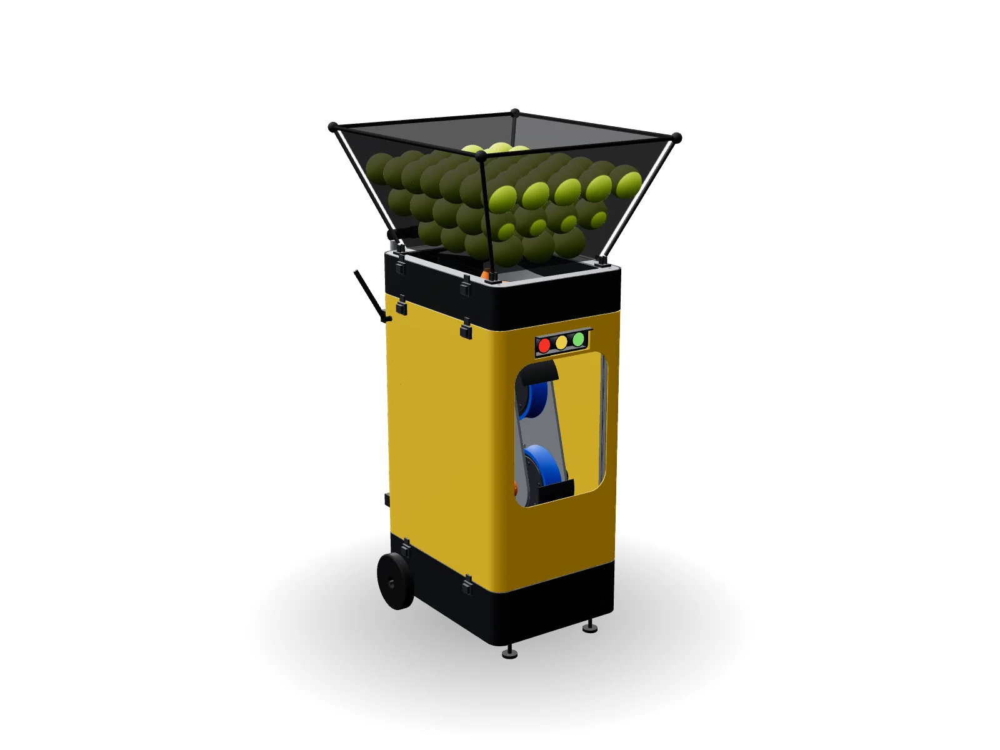

# Lançador de Bolas de Tênis

Máquina de treino com duas rodas de velocidade independente para controlar o spin, cabeça com giro e inclinação motorizados e baterias Makita 18 V. Projeto aberto, pensado para ser construído com impressão 3D, corte a laser e peças de prateleira.

**Apresentação do projeto:** https://brodwolf.github.io/lancador-tenis/



| Especificação | Valor |
| --- | --- |
| Velocidade da bola | 30–120 km/h |
| Spin | −2.500 rpm (slice) a +3.000 rpm (topspin) |
| Giro / inclinação | ±30° / ±15° |
| Hopper | 80–100 bolas |
| Autonomia | 2,3–4,5 h com 2 baterias Makita 5,0 Ah |
| Dimensões | 55 × 45 × ~120 cm, ~20–24 kg |
| Custo estimado | R$ 5,4–8,9 mil, sem baterias |

## O que tem aqui

| Pasta | Conteúdo |
| --- | --- |
| `index.html`, `assets/` | Página de apresentação com o modelo 3D interativo e a simulação na quadra (GitHub Pages) |
| `PROJETO.md` | Memorial técnico em Markdown (sem preços e sem próximos passos) |
| `cad/montagem/` | Montagem completa em STEP (Fusion 360, FreeCAD, Onshape, SolidWorks) |
| `cad/impressao_3d/` | STL e STEP das 32 peças impressas |
| `cad/corte_laser/` | DXF das 13 chapas (mm, 1:1) e pranchas em PDF |
| `cad/usinagem/` | Eixos em STEP |
| `cad/lista_de_pecas.csv` | Todas as peças com categoria, material e quantidade |
| `cad/lancador.py` | Modelo paramétrico em CadQuery |

## Gerar os arquivos de novo

```
pip install cadquery ezdxf matplotlib
cd cad
python3 exportar.py      # recria STEP, STL, DXF, GLB e a lista de peças em cad/saida/
python3 verificar.py     # confere interferências em 7 posições e o caminho da bola
```

Os parâmetros principais (tamanho da estrutura, altura do pivô, diâmetro e vão das rodas, posição do eixo de giro) ficam no topo de `cad/lancador.py`.

## Antes de mandar cortar

Os furos de peças compradas seguem cotas de catálogo. Confira com a peça na mão: KFL001 (48 mm entre furos, M6), KFL08 (37 mm, M4) e a furação do lazy susan, que varia por fabricante. Detalhes em `cad/LEIAME.md`.
